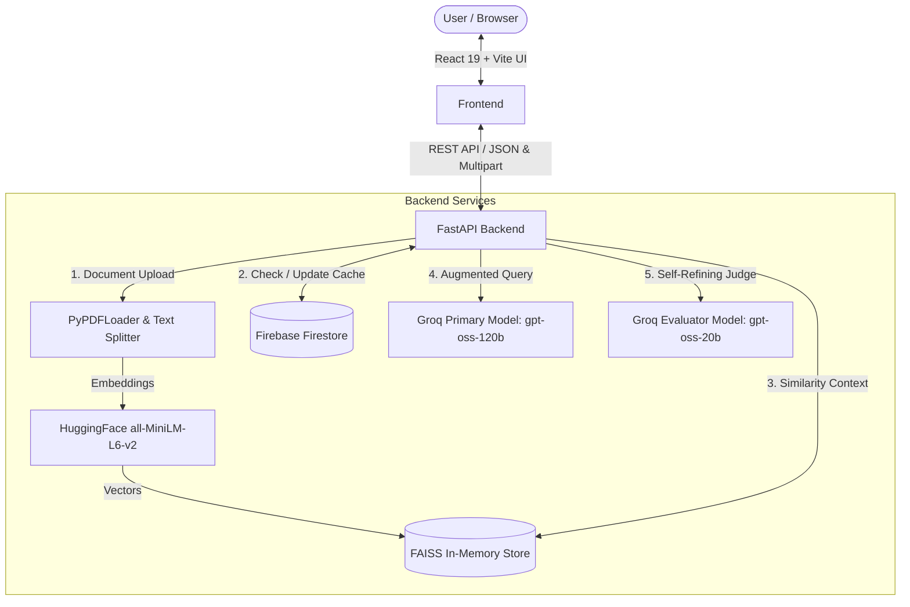

# Smart Caching System & Self-Refining AI Assistant

[](https://fastapi.tiangolo.com)
[](https://react.dev)
[](https://vitejs.dev)
[](https://groq.com)
[](https://firebase.google.com)
[](https://python.langchain.com)

A high-performance, full-stack AI Assistant application featuring **intelligent semantic caching**, **Retrieval-Augmented Generation (RAG)** for PDF documents, and an **autonomous AI evaluator** that continuously refines stored knowledge.

---

## 🌟 Key Features

- **⚡ Blazing Fast AI Inference**: Powered by ultra-low-latency LPU inference via Groq (`openai/gpt-oss-120b`).
- **🧠 Self-Refining AI Evaluator**: Compares freshly generated answers against cached database responses (`openai/gpt-oss-20b`) to continuously improve accuracy and conciseness.
- **📄 Document Context RAG**: Upload any PDF document to extract, chunk, and index text into an in-memory FAISS vector database using local HuggingFace embeddings (`all-MiniLM-L6-v2`).
- **💾 Cloud Semantic Cache**: Persistent storage with Google Cloud Firestore (`aura_cache` collection) for lightning-fast retrieval of recurring queries and automated cache evolution.
- **🎨 Modern Glassmorphic Web Interface**: Built with React 19 and Vite featuring real-time markdown rendering, file upload indicators, smooth scrolling, and responsive pill-style input design.

---

## 🏗️ Architecture Overview



---

## 📁 Repository Structure

```
├── backend/
│   ├── main.py                     # FastAPI application & RAG/Cache logic
│   ├── requirements.txt            # Python dependencies
│   ├── .env.example                # Backend environment template
│   └── firebase-credentials.json   # Firebase service account key
├── frontend/
│   ├── src/
│   │   ├── App.jsx                 # Main React chat & upload interface
│   │   ├── App.css                 # Application styling
│   │   ├── index.css               # Global base styles
│   │   └── main.jsx                # React entrypoint
│   ├── index.html                  # HTML template
│   ├── package.json                # Frontend dependencies & scripts
│   ├── vite.config.js              # Vite configuration
│   └── .env.example                # Frontend environment template
├── .gitignore                      # Git ignore rules
├── LICENSE                         # Apache 2.0 License
└── README.md                       # Documentation
```

---

## 🚀 Getting Started

### Prerequisites

- **Python**: 3.10 to 3.14
- **Node.js**: v18+ and npm
- **Groq API Key**: Obtainable from [Groq Console](https://console.groq.com)
- **Firebase Project**: Service account credentials JSON with Cloud Firestore enabled

---

### 1. Backend Setup

1. **Navigate to the backend directory:**
   ```bash
   cd backend
   ```

2. **Create and activate a virtual environment (optional but recommended):**
   ```bash
   # Windows PowerShell
   python -m venv venv
   .\venv\Scripts\Activate.ps1

   # Linux / macOS
   python3 -m venv venv
   source venv/bin/activate
   ```

3. **Install dependencies:**
   ```bash
   pip install -r requirements.txt
   ```

4. **Configure environment variables:**
   Copy `.env.example` to `.env`:
   ```bash
   cp .env.example .env
   ```
   Edit `.env` to include your Groq API keys:
   ```env
   api_request=gsk_your_groq_api_key_here
   api_compare=gsk_your_groq_evaluator_api_key_here
   ```

5. **Configure Firebase:**
   Ensure `firebase-credentials.json` is located in the `backend/` directory or specify its location via `FIREBASE_CREDENTIALS_PATH`.

6. **Start the FastAPI backend server:**
   ```bash
   uvicorn main:app --reload --host 127.0.0.1 --port 8000
   ```
   The backend will be available at `http://127.0.0.1:8000`. Interactive API documentation is available at `http://127.0.0.1:8000/docs`.

---

### 2. Frontend Setup

1. **Navigate to the frontend directory:**
   ```bash
   cd frontend
   ```

2. **Install npm dependencies:**
   ```bash
   npm install
   ```

3. **Configure environment variables:**
   Copy `.env.example` to `.env`:
   ```bash
   cp .env.example .env
   ```
   Ensure `VITE_BACKEND_URL` points to your running backend:
   ```env
   VITE_BACKEND_URL=http://127.0.0.1:8000
   ```

4. **Start the Vite development server:**
   ```bash
   npm run dev
   ```
   Open your browser at `http://localhost:5173`.

---

## 📡 API Reference

### `GET /`
Returns service status and API version.

### `GET /health`
Health check endpoint reporting connectivity to Firestore and RAG vector store readiness.

### `POST /upload`
Upload a PDF document to be indexed in the vector database for RAG context.
- **Request**: `multipart/form-data` with field `file` (`.pdf`).
- **Response**:
  ```json
  {
    "message": "Successfully processed and embedded document.pdf (12 chunks)"
  }
  ```

### `POST /chat`
Submit a question to the AI assistant.
- **Request Body**:
  ```json
  {
    "query": "What is the summary of the uploaded document?"
  }
  ```
- **Response**:
  ```json
  {
    "answer": "Here is the summary based on the document...",
    "cached": false,
    "refined": false
  }
  ```

---

## 🛠️ Testing & Building

### Frontend Lint and Build
```bash
cd frontend
npm run lint
npm run build
```

### Backend Validation
```bash
cd backend
python -c "import main; print('Ready')"
```

---

## 📄 License

This project is licensed under the Apache 2.0 License - see the [LICENSE](LICENSE) file for details.